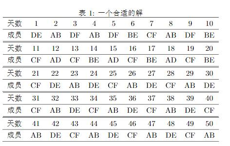

#

## 背景
为了方便在latex中输入大量数据的横表,写了这个
## 格式要求
输入的json要求以如下形式呈现

    [
        {
            attr:"姓名",
            value:[
                "张","李","王二麻子"
        ]},
        {
            attr:"年龄",
            value:[
                "18","50","36"
        ]},
        {
            attr:"身高",
            value:[
                "179","158","169"
        ]}
    ]
## 调用
    P.CreatTable()
    P.setCaption("一个合适的解")
    P.Generate()
还有其他的设置函数见类方法的名称,或者手动设置

## 效果
